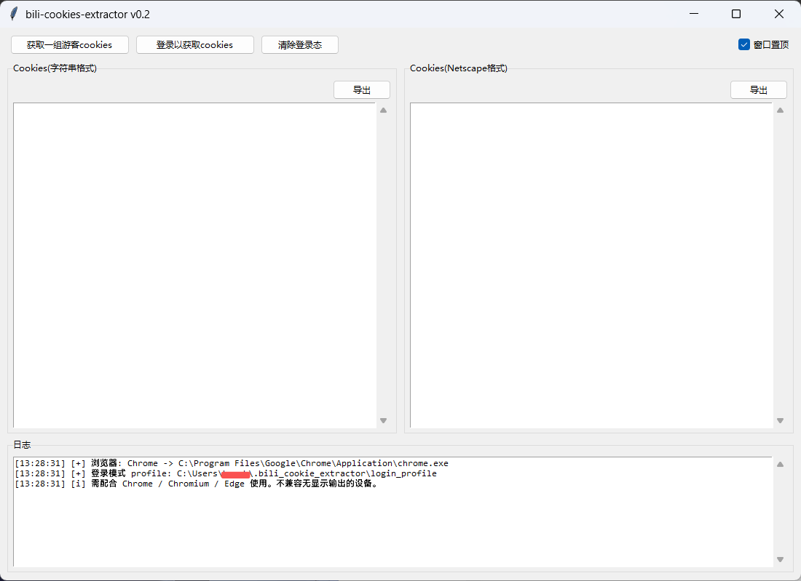

# bili-cookies-extractor / 哔哩Cookie提取工具

跨平台 B 站 Cookie 提取工具，支持访客模式与登录模式，可导出字符串 / Netscape 格式。

> **关于代码质量**：本项目作者并非专业 Python 开发者，代码可能不够优雅，欢迎接手。


---

## 简介



**bili-cookies-extractor** 是一款交互式 B 站 Cookie 提取工具，用于配合 `Bili-AutoCrawler / 哔哩爬取姬` 使用。

它通过 DrissionPage 调用本机已安装的 Chrome / Chromium / Edge，自动访问 B 站并提取 Cookie，支持：

- 游客模式：快速获取一组访客 Cookie
- 登录模式：打开浏览器让你登录，然后提取登录态 Cookie
- 双格式导出：字符串格式 / Netscape 格式

> 本项目在v0.2后公开源码，欢迎 Fork、二次开发（商业行为除外）。

---

## 注意

**不兼容无头服务器**

---

## 联动项目

- [Bili-AutoCrawler / 哔哩爬取姬](https://github.com/hsushjk/Bili-AutoCrawler)  
  本项目为其配套 Cookie 提取工具，导出的 `cookies.txt` 可直接给爬取姬使用。

---

## 环境要求

- Python 3.8+
- [DrissionPage](https://github.com/g1879/DrissionPage)
- 本机已安装以下任意浏览器：
  - Google Chrome
  - Chromium
  - Microsoft Edge

> 注意：需要图形界面环境，不支持无头服务器。  

---

## 快速开始

可以通过 Releases 下载编译好的文件，或者：

### 1. 克隆仓库

```bash
git clone https://github.com/hsushjk/bili-cookies-extractor.git
cd bili-cookies-extractor
```

### 2. 安装 Python 依赖

```bash
pip install DrissionPage
```

### 3. 准备浏览器

确保本机已安装 Chrome / Chromium / Edge。Chrome 和 Chromium 优先

程序会自动查找常见安装路径：

- Windows：Chrome、Edge 默认安装路径
- Linux：`google-chrome`、`chromium`、`microsoft-edge` 等命令
- macOS：`/Applications/` 下的 Chrome、Chromium、Edge

如果浏览器是免安装版或自定义路径，可能无法自动识别。

### 4. 运行

```bash
python bce.py
```

启动后进入图形界面：

- **获取一组游客cookies**：游客模式，不登录
- **登录以获取cookies**：打开登录页，登录后提取
- **清除登录态**：删除已保存的登录 profile
- **窗口置顶**：让工具窗口保持最前
- **导出**：分别导出字符串格式或 Netscape 格式

---

## 使用说明

### 游客模式

1. 点击“获取一组游客cookies”
2. 程序会启动一个临时浏览器 profile
3. 自动访问 B 站并提取 Cookie
4. 如果检测到 `SESSDATA`，会强制剔除，避免污染
5. 提取完成后可导出为字符串或 Netscape 格式

### 登录模式

1. 点击“登录以获取cookies”
2. 程序会打开 B 站登录页
3. 请在浏览器窗口中完成登录
4. 最多等待 180 秒
5. 登录成功后自动提取 Cookie
6. 登录 profile 自动保存

下次使用登录模式会复用该 profile。

### 导出格式

- **字符串格式**：`name=value; name2=value2; ...`
- **Netscape 格式**：标准 `cookies.txt`，可被 `yt-dlp`、`requests`、`curl` 等使用

推荐给 `Bili-AutoCrawler` 使用 Netscape 格式。

---

## 更新日志

### v0.2

- 支持 Edge
- 支持窗口置顶
- 添加弹窗提示

### v0.1

- 第一版，用于配合爬取姬使用

---

## 声明

1. 本工具仅供个人学习、研究与技术交流使用。
2. 禁止任何形式的商业用途，包括但不限于倒卖、付费分发、商业集成、商业服务。
3. 请遵守哔哩哔哩用户协议及相关法律法规。
4. 请尊重内容创作者版权，下载内容请勿传播或用于侵权用途。
5. 请勿将本工具用于恶意爬取、攻击、商业倒卖或插入恶意代码后二次分发。
6. 本工具使用 Cookie 仅用于本地请求与下载，请自行妥善保管 Cookie 文件。
7. 作者不对使用本工具产生的任何后果负责。

---

## 致谢

感谢以下开源项目：

- [DrissionPage](https://github.com/g1879/DrissionPage)
- 以及其它未被提及的贡献者

---

**哔哩哔哩 (゜-゜)つロ 干杯~ 🥂**